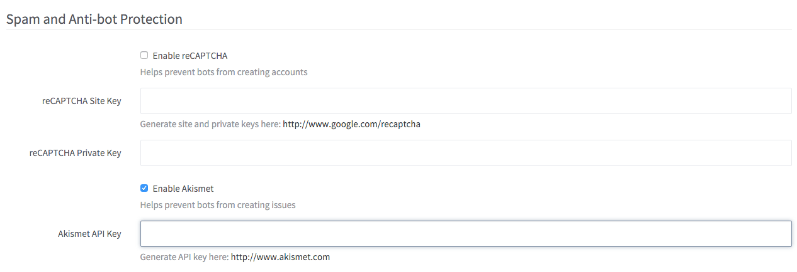

# Akismet

GitLab leverages [Akismet](https://akismet.com/) to protect against spam. Currently
GitLab uses Akismet to prevent the creation of spam issues on public projects. Issues
created via the web UI or the API can be submitted to Akismet for review.

Detected spam will be rejected, and an entry in the "Spam Log" section in the
Admin page will be created.

Privacy note: GitLab submits the user's IP and user agent to Akismet.

NOTE: **Note:**
In GitLab 8.11 and later, all issues are submitted to Akismet.
In earlier GitLab versions, this only applied to API and non-project members.

## Configuration

To use Akismet:

1. Go to the URL: <https://akismet.com/account/>
1. Sign-in or create a new account.
1. Click on **Show** to reveal the API key.
1. Go to **Admin Area > Settings > Reporting** (`/admin/application_settings/reporting`).
1. Check the **Enable Akismet** checkbox.
1. Fill in the API key from step 3.
1. Save the configuration.

## Training

NOTE: **Note:**
Training the Akismet filter is only available in GitLab 8.11 and later.

As a way to better recognize between spam and ham, you can train the Akismet
filter whenever there is a false positive or false negative.

When an entry is recognized as spam, it is rejected and added to the Spam Logs.
From here you can review if they are really spam. If one of them is not really
spam, you can use the **Submit as ham** button to tell Akismet that it falsely
recognized an entry as spam.

If an entry that is actually spam was not recognized as such, you will be able
to also submit this to Akismet. The **Submit as spam** button will only appear
to admin users.

Training Akismet will help it to recognize spam more accurately in the future.
