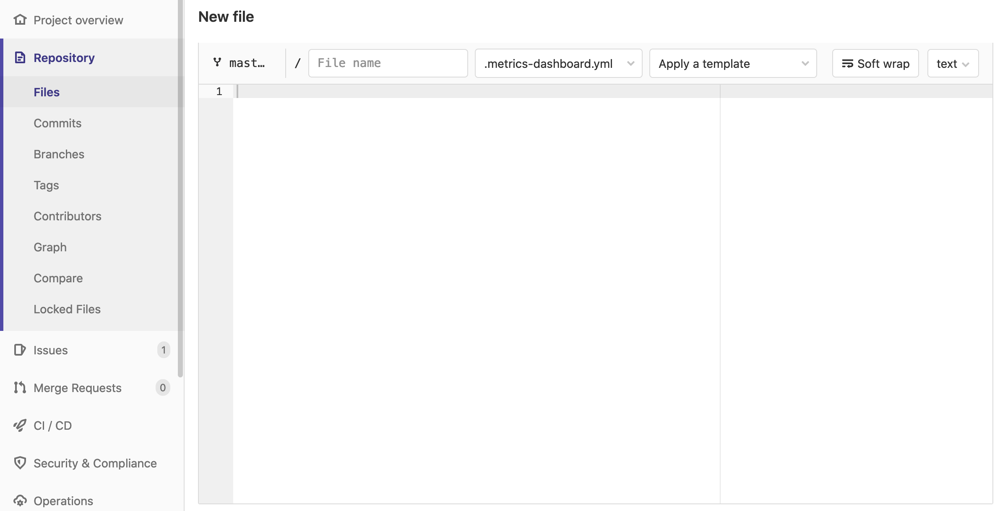
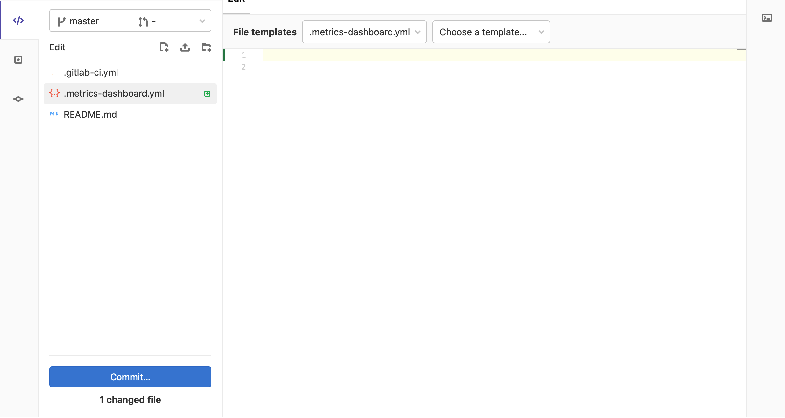

# Developing templates for custom dashboards **(CORE)**

GitLab provides a template to make it easier for you to create templates for
[custom dashboards](index.md). Templates provide helpful guidance and
commented-out examples you can use.

## Apply a dashboard template

Navigate to the browser-based editor of your choice:

- In the **Repository view**:

  1. Navigate to **{doc-text}** **Repository > Files**.
  1. Click **{plus}** **Add to tree** and select **New file**,
     then click **Select a template type** to see a list of available templates:
     

- In the **[Web IDE](../../../user/project/web_ide/index.md)**:

  1. Click **Web IDE** when viewing your repository.
  1. Click **{doc-new}** **New file**, then click **Choose a template** to see a list of available templates:
     

## Custom dashboard templates **(PREMIUM ONLY)**

To enable and use a custom dashboard templates on your GitLab instance, read the
[guide for creating custom templates](../../../user/admin_area/settings/instance_template_repository.md).
