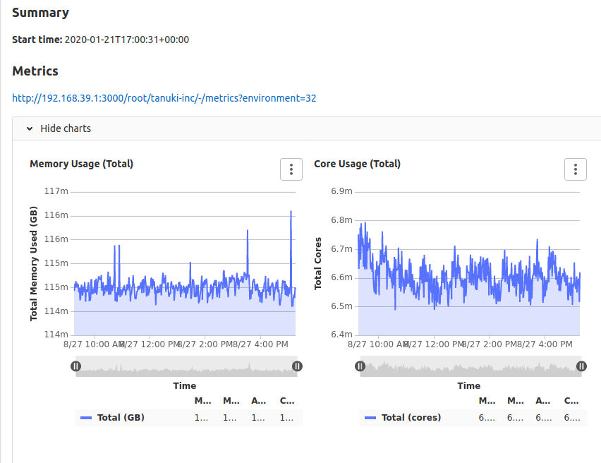
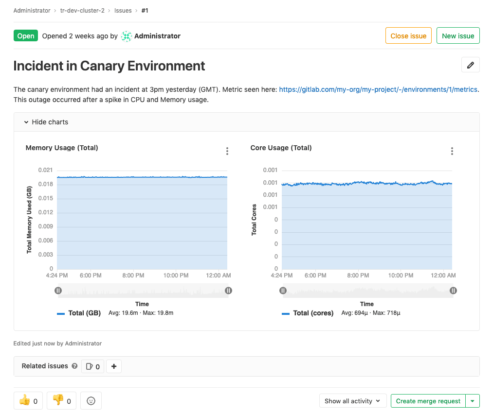
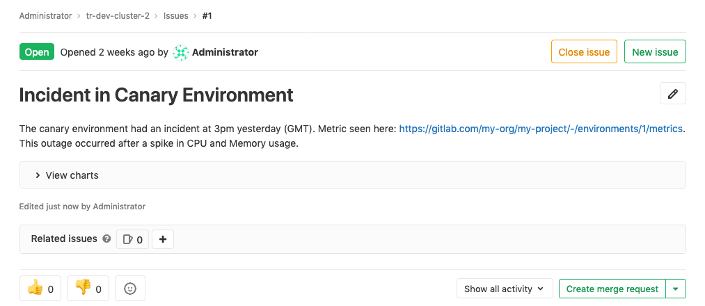
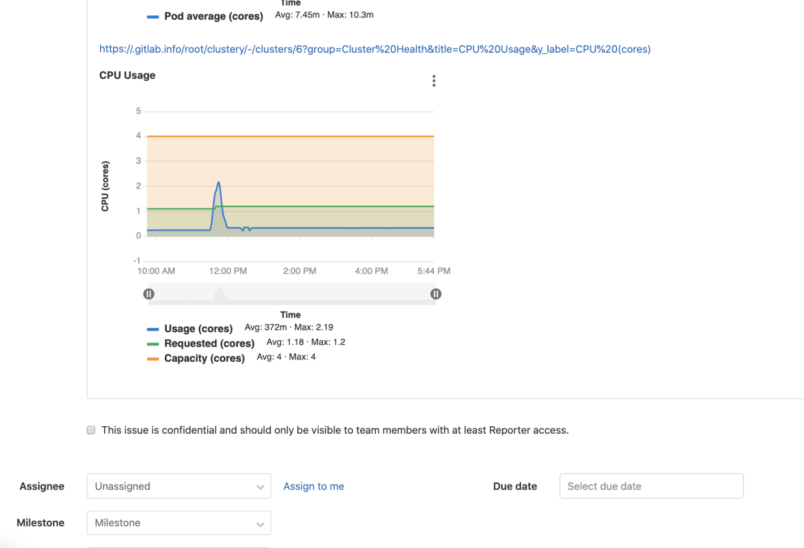

# Embedding metric charts within GitLab-flavored Markdown **(CORE)**

You can display metrics charts within
[GitLab Flavored Markdown](../../user/markdown.md#gitlab-flavored-markdown-gfm)
fields such as issue or merge request descriptions. The maximum number of embedded
charts allowed in a GitLab Flavored Markdown field is 100.
Embedding charts is useful when sharing an application incident or performance
metrics to others, and you want to have relevant information directly available.

## Embedding GitLab-managed Kubernetes metrics

> [Introduced](https://gitlab.com/gitlab-org/gitlab-foss/-/merge_requests/29691) in GitLab 12.2.

This feature requires [Kubernetes](../../user/project/integrations/prometheus_library/kubernetes.md) metrics.

Note: **Note:**
In GitLab versions 13.3 and earlier, metrics dashboard links were in the form
`https://<root_url>/<project>/-/environments/<environment_id>/metrics`. These links
are still supported, and can be used to embed metric charts.

To display metric charts, include a link of the form
`https://<root_url>/<project>/-/metrics?environment=<environment_id>` in a field
that supports GitLab-flavored Markdown:

```markdown
### Summary

**Start time:** 2020-01-21T12:00:31+00:00

### Metrics

https://gitlab.com/gitlab-org/monitor/tanuki-inc/-/metrics?environment=1118134
```

GitLab unfurls the link as an embedded metrics panel:



You can also embed a single chart. To get a link to a chart, click the
**{ellipsis_v}** **More actions** menu in the upper right corner of the chart,
and select **Copy link to chart**, as shown in this example:


The following requirements must be met for the metric to unfurl:

- The `<environment_id>` must correspond to a real environment.
- Prometheus must be monitoring the environment.
- The GitLab instance must be configured to receive data from the environment.
- The user must be allowed access to the monitoring dashboard for the environment ([Reporter or higher](../../user/permissions.md)).
- The dashboard must have data within the last 8 hours.

 If all of the above are true, then the metric unfurls as seen below:



Metric charts may also be hidden:



You can open the link directly into your browser for a
[detailed view of the data](dashboards/index.md#chart-context-menu).

## Embedding metrics in issue templates

You can also embed either the overview dashboard metrics or individual metrics in
issue templates. For charts to render side-by-side, separate links to the entire metrics
dashboard or individual metrics by either a comma or a space.


## Embedding metrics based on alerts in incident issues

For [GitLab-managed alerting rules](alerts.md), the issue includes an embedded
chart for the query corresponding to the alert. The chart displays an hour of data
surrounding the starting point of the incident, 30 minutes before and after.

For [manually configured Prometheus instances](../../user/project/integrations/prometheus.md#manual-configuration-of-prometheus),
a chart corresponding to the query can be included if these requirements are met:

- The alert corresponds to an environment managed through GitLab.
- The alert corresponds to a [range query](https://prometheus.io/docs/prometheus/latest/querying/api/#range-queries).
- The alert contains the required attributes listed in the chart below.

| Attributes | Required | Description |
| ---------- | -------- | ----------- |
| `annotations/gitlab_environment_name` | Yes | Name of the GitLab-managed environment corresponding to the alert |
| One of `annotations/title`, `annotations/summary`, `labels/alertname` | Yes | Used as the chart title |
| `annotations/gitlab_y_label` | No | Used as the chart's y-axis label |

## Embedding cluster health charts

> - [Introduced](<https://gitlab.com/gitlab-org/gitlab/-/issues/40997>) in [GitLab Ultimate](https://about.gitlab.com/pricing/) 12.9.
> - [Moved](<https://gitlab.com/gitlab-org/gitlab/-/issues/208224>) to GitLab core in 13.2.

[Cluster Health Metrics](../../user/project/clusters/index.md#visualizing-cluster-health)
can also be embedded in [GitLab-flavored Markdown](../../user/markdown.md).

To embed a metric chart, include a link to that chart in the form
`https://<root_url>/<project>/-/cluster/<cluster_id>?<query_params>` anywhere that
GitLab-flavored Markdown is supported. To generate and copy a link to the chart,
follow the instructions in the
[Cluster Health Metric documentation](../../user/project/clusters/index.md#visualizing-cluster-health).

The following requirements must be met for the metric to unfurl:

- The `<cluster_id>` must correspond to a real cluster.
- Prometheus must be monitoring the cluster.
- The user must be allowed access to the project cluster metrics.
- The dashboards must be reporting data on the
  [Cluster Health Page](../../user/project/clusters/index.md#visualizing-cluster-health)

 If the above requirements are met, then the metric unfurls as seen below.


