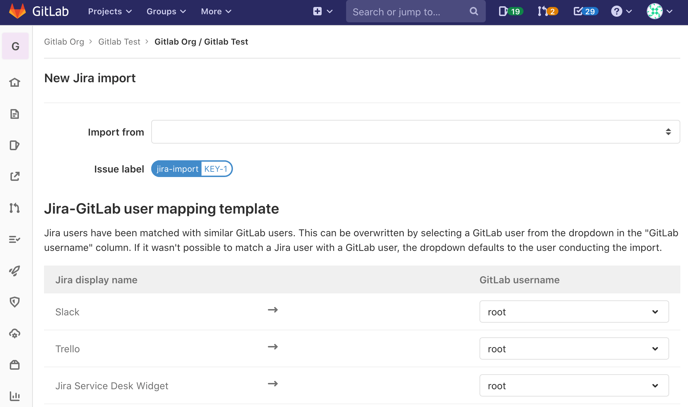

# Import your Jira project issues to GitLab

> [Introduced](https://gitlab.com/groups/gitlab-org/-/epics/2766) in GitLab 12.10.

Using GitLab Jira importer, you can import your Jira issues to GitLab.com or to
your self-managed GitLab instance.

Jira issues import is an MVC, project-level feature, meaning that issues from multiple
Jira projects can be imported into a GitLab project. MVC version imports issue title and description
as well as some other issue metadata as a section in the issue description.

## Known limitations

The information imported into GitLab fields from Jira depends on the version of GitLab:

- From GitLab 12.10 to GitLab 13.1, only the issue's title and description are imported
  directly.
- From GitLab 13.2:
  - The issue's labels are also imported directly.
  - You're also able to map Jira users to GitLab project members when preparing for the
    import.

Other Jira issue metadata that is not formally mapped to GitLab issue fields is
imported into the GitLab issue's description as plain text.

Our parser for converting text in Jira issues to GitLab Flavored Markdown is only compatible with
Jira V3 REST API.

There is an [epic](https://gitlab.com/groups/gitlab-org/-/epics/2738) tracking the addition of
items, such as issue assignees, comments, and much more. These will be included in the future
iterations of the GitLab Jira importer.

## Prerequisites

### Permissions

In order to be able to import issues from a Jira project you need to have read access on Jira
issues and a [Maintainer or higher](../../permissions.md#project-members-permissions) role in the
GitLab project that you wish to import into.

### Jira integration

This feature uses the existing GitLab [Jira integration](../integrations/jira.md).

Make sure you have the integration set up before trying to import Jira issues.

## Import Jira issues to GitLab

> New import form [introduced](https://gitlab.com/gitlab-org/gitlab/-/issues/216145) in GitLab 13.2.

To import Jira issues to a GitLab project, follow the steps below.

NOTE: **Note:**
Importing Jira issues is done as an asynchronous background job, which
may result in delays based on import queues load, system load, or other factors.
Importing large projects may take several minutes depending on the size of the import.

1. On the **{issues}** **Issues** page, click **Import Issues** (**{import}**) **> Import from Jira**.

   

   The **Import from Jira** option is only visible if you have the [correct permissions](#permissions).

   The following form appears.
   If you've previously set up the [Jira integration](../integrations/jira.md), you can now see
   the Jira projects that you have access to in the dropdown.

   

1. Click the **Import from** dropdown and select the Jira project that you wish to import issues from.

   In the **Jira-GitLab user mapping template** section, the table shows to which GitLab users your Jira
   users will be mapped.
   When the form appears, the dropdown defaults to the user conducting the import.

1. To change any of the mappings, click the dropdown in the **GitLab username** column and
   select the user you want to map to each Jira user.

   The dropdown may not show all the users, so use the search bar to find a specific
   user in this GitLab project.

1. Click **Continue**. You're presented with a confirmation that import has started.

   While the import is running in the background, you can navigate away from the import status page
   to the issues page, and you'll see the new issues appearing in the issues list.

1. To check the status of your import, go to the Jira import page again.
